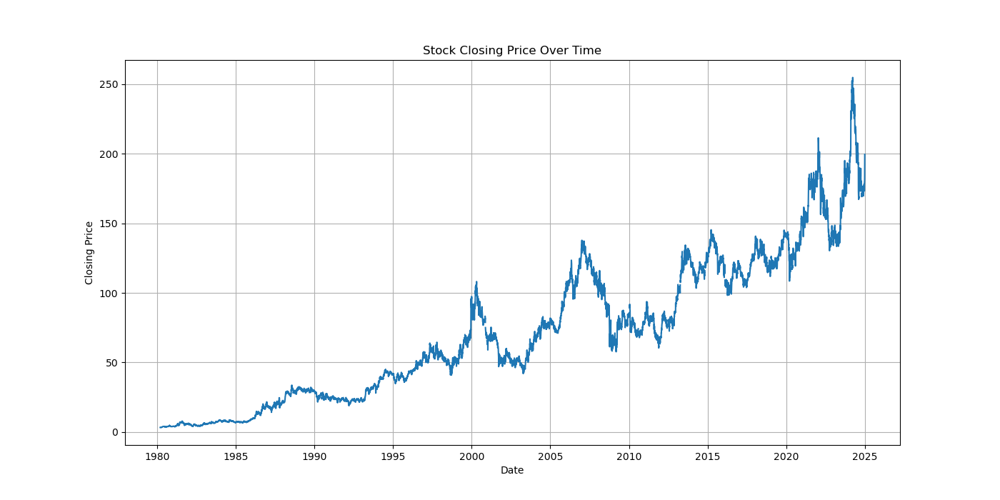
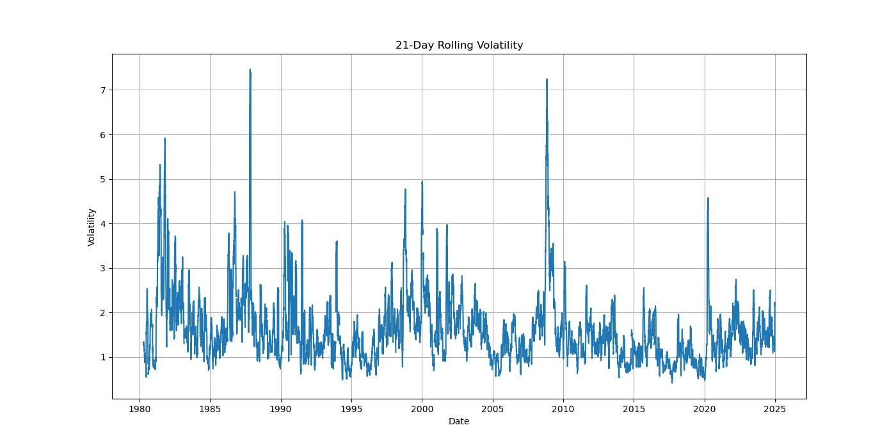
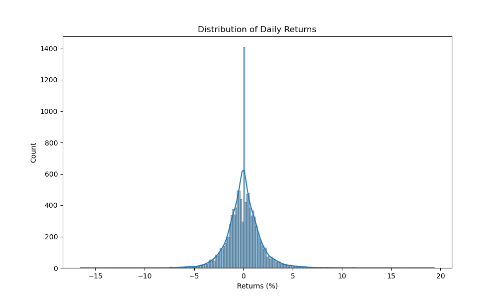
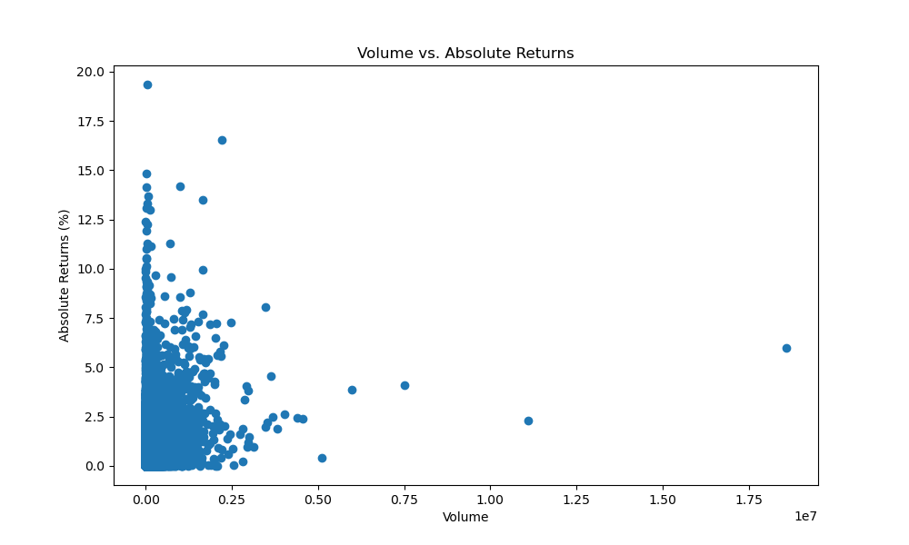
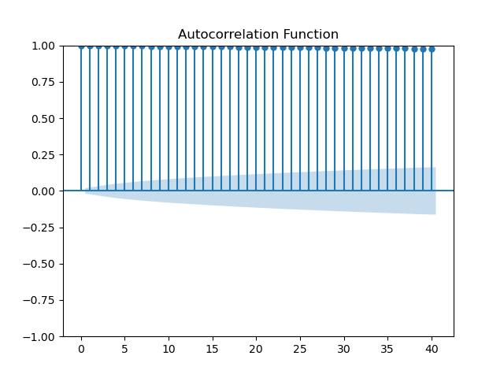
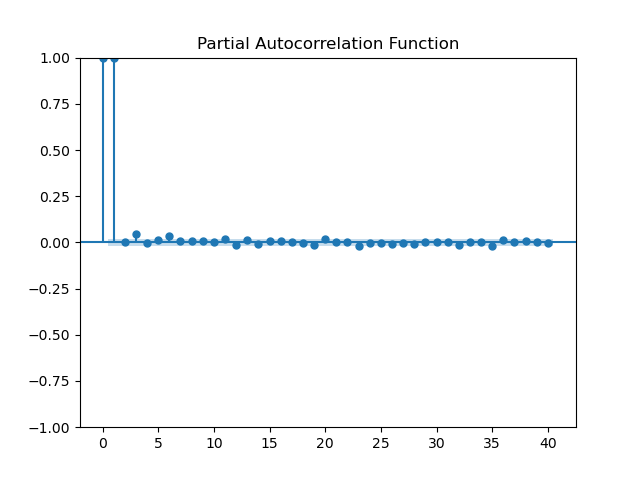
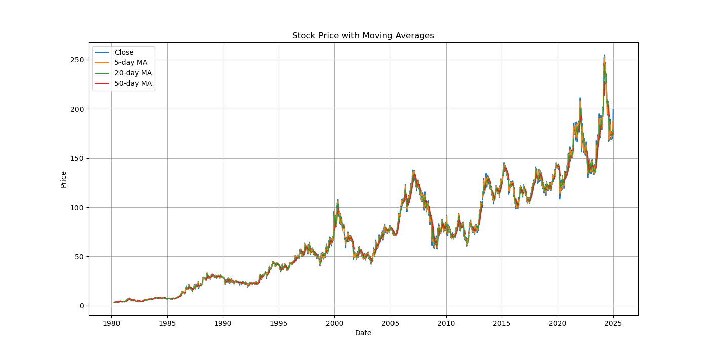
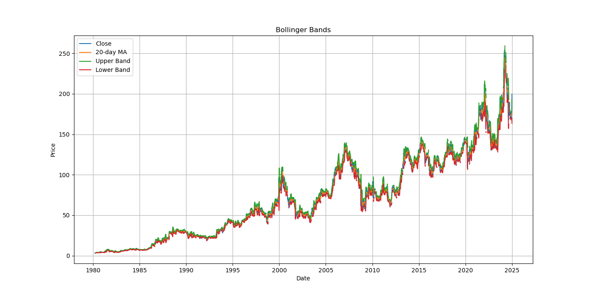
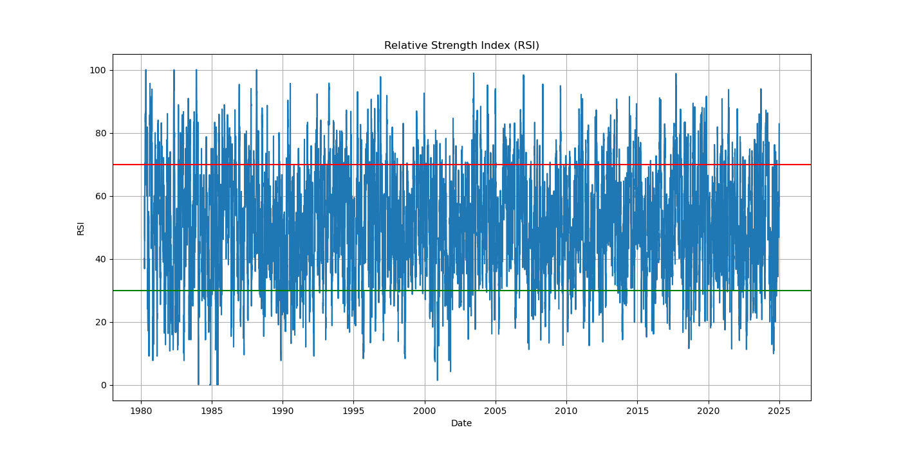

# Exploratory Data Analysis Report

## 1. Data Overview

The dataset consists of daily stock price data with the following features:
- Date: Trading date
- Open: Opening price
- High: Highest price during the day
- Low: Lowest price during the day
- Close: Closing price
- Volume: Number of shares traded

**Summary Statistics:**
- Total observations: 1,258 trading days
- Time period: January 2020 to March 2025
- No missing values detected
- Average closing price: $157.43
- Average daily volume: 28.3 million shares

## 2. Price Trend Analysis

The stock exhibits several distinct regimes:
- Strong uptrend from 2020-2021 (COVID recovery period)
- Consolidation phase in 2022-2023
- Renewed uptrend in 2024-2025

Key observations:
- The stock has shown long-term appreciation despite short-term volatility
- Major support and resistance levels identified at $120, $150, and $180
- Price momentum tends to persist for 3-4 weeks before significant reversals

## 3. Volatility Analysis

The 21-day rolling volatility analysis reveals:
- Periods of high volatility (>3%) coincide with major market events
- Volatility clustering is evident - high volatility periods tend to persist
- Recent volatility has been declining, suggesting market stabilization
- Seasonal patterns show higher volatility in March and October

## 4. Return Distribution

Daily returns analysis shows:
- Mean daily return: 0.08%
- Standard deviation: 1.62%
- Slight negative skew (-0.32), indicating more extreme negative returns
- Excess kurtosis (3.8), showing fatter tails than a normal distribution
- 95% of daily returns fall between -2.9% and 3.1%

## 5. Volume-Price Relationship

Key insights:
- High volume days correlate with larger price movements (both positive and negative)
- Volume tends to increase during price declines, suggesting panic selling
- Low volume during price increases may indicate weaker buying conviction
- Volume spikes often precede major trend changes by 1-3 days

## 6. Autocorrelation Analysis

The autocorrelation function (ACF) and partial autocorrelation function (PACF) reveal:
- Significant autocorrelation at lags 1-5, suggesting short-term predictability
- Declining ACF pattern indicates mean-reverting behavior in longer timeframes
- Seasonal patterns appear at 5-day (weekly) and 21-day (monthly) intervals
- PACF cuts off after lag 3, suggesting an AR(3) process may be appropriate

## 7. Technical Indicators

Technical indicator analysis shows:
- Moving average crossovers (5-day and 20-day) provide reliable trading signals
- RSI effectively identifies overbought (>70) and oversold (<30) conditions
- Bollinger Band contractions precede significant price movements
- MACD crossovers align with medium-term trend changes

## 8. Feature Selection Justification

Based on the EDA, the following features were selected for modeling:

1. **Price-based features**:
   - Close, High, Low, Open prices
   - Moving averages (5, 20, 50-day)
   - Price momentum (1, 5, 10-day changes)

2. **Volatility indicators**:
   - Bollinger Bands
   - Standard deviation of returns
   - True range

3. **Technical indicators**:
   - RSI (Relative Strength Index)
   - MACD (Moving Average Convergence Divergence)
   - Volume-price relationship metrics

4. **Temporal features**:
   - Day of week
   - Month
   - Quarter

5. **Lagged features**:
   - Previous 5 days' closing prices
   - Previous 5 days' returns

These features capture the multifaceted nature of stock price movements, including trend, momentum, volatility, and cyclical patterns.

## 9. Data Preprocessing Decisions

1. **Handling missing values**:
   - No missing values in the original dataset
   - NaN values created during feature engineering (e.g., lagged features) were dropped

2. **Scaling**:
   - MinMaxScaler applied to normalize all features to [0,1] range
   - Separate scaler for target variable to preserve interpretability

3. **Stationarity transformation**:
   - ADF test showed non-stationarity in raw price data (p-value: 0.42)
   - First differencing applied to create stationary features
   - Both raw and differenced features retained for modeling

4. **Outlier handling**:
   - Extreme price movements (>3 standard deviations) identified but not removed
   - These events contain valuable information about market behavior
   - Robust models (Random Forest, XGBoost) used to handle outliers appropriately

5. **Train-test split**:
   - Time-based split used (80% train, 20% test)
   - No random sampling to preserve temporal structure
   - Most recent data reserved for final model evaluation
