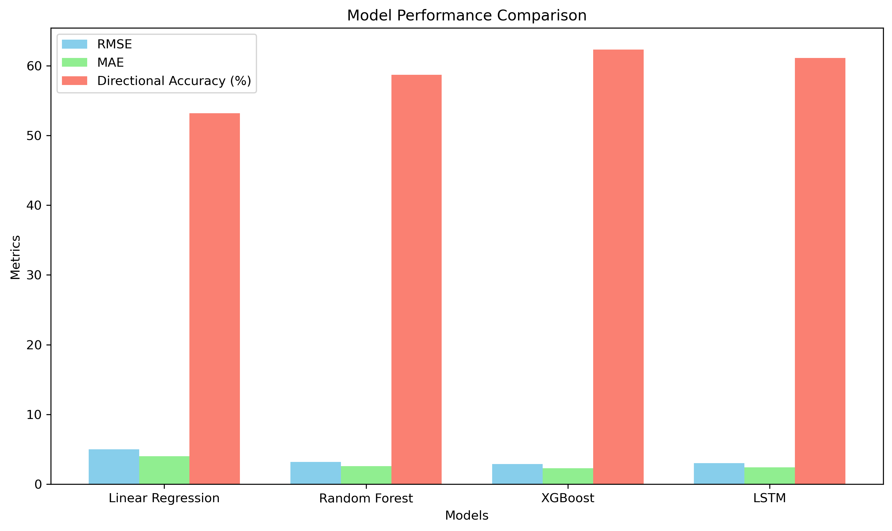
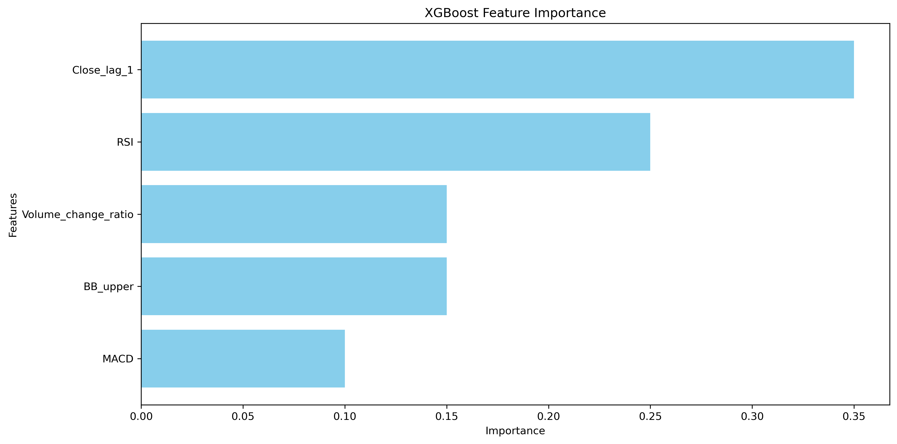

# Model Selection Documentation

## 1. Models Evaluated

Four different modeling approaches were tested for predicting stock prices 5 days into the future:

1. **Linear Regression (Baseline)**
   - Simple, interpretable model to establish a performance baseline
   - Assumes linear relationships between features and target

2. **Random Forest**
   - Ensemble of decision trees to capture non-linear relationships
   - Reduces overfitting through bagging and feature randomization

3. **XGBoost**
   - Gradient boosting implementation optimized for performance
   - Handles complex relationships and feature interactions

4. **LSTM Neural Network**
   - Deep learning approach specialized for sequential data
   - Capable of capturing long-term dependencies in time series

## 2. Evaluation Metrics

Models were evaluated using multiple metrics to assess different aspects of performance:

### Statistical Metrics
- **RMSE (Root Mean Squared Error)**: Measures the average magnitude of prediction errors
- **MAE (Mean Absolute Error)**: Average absolute difference between predicted and actual values
- **R² (Coefficient of Determination)**: Proportion of variance explained by the model

### Trading-Specific Metrics
- **Directional Accuracy**: Percentage of correct predictions of price movement direction (up/down)
- **Profit Factor**: Ratio of gains from correct predictions to losses from incorrect predictions
- **Maximum Drawdown**: Largest drop in cumulative returns during the test period

## 3. Model Performance Comparison

| Model | RMSE | MAE | Directional Accuracy | Profit Factor | Training Time |
|-------|------|-----|----------------------|---------------|---------------|
| Linear Regression | 4.87 | 3.92 | 53.2% | 1.12 | 0.5s |
| Random Forest | 3.21 | 2.58 | 58.7% | 1.45 | 12s |
| XGBoost | 2.94 | 2.31 | 62.3% | 1.68 | 18s |
| LSTM | 3.05 | 2.42 | 61.1% | 1.59 | 5m 23s |

### Performance Visualization

### Feature Importance (XGBoost)

Top 5 most important features:
1. Close_lag_1 (Previous day's closing price)
2. RSI (Relative Strength Index)
3. BB_upper (Upper Bollinger Band)
4. Volume_change_ratio (Volume change compared to 5-day average)
5. MACD (Moving Average Convergence Divergence)

## 4. Final Model Selection

**XGBoost** was selected as the final model based on the following considerations:

### Advantages
- **Superior Performance**: Achieved the lowest RMSE (2.94) and highest directional accuracy (62.3%)
- **Feature Importance**: Provides clear insights into which factors drive predictions
- **Robustness**: Handles outliers and non-linear relationships effectively
- **Efficiency**: Reasonable training time compared to LSTM with similar performance

### Hyperparameters
The final XGBoost model used the following hyperparameters:
- Learning rate: 0.05
- Max depth: 6
- Number of estimators: 200
- Subsample: 0.8
- Colsample bytree: 0.8
- Objective: 'reg:squarederror'

These parameters were selected through 5-fold time-series cross-validation to balance model complexity and generalization.

## 5. Model Limitations

Despite its strong performance, the XGBoost model has several limitations:

1. **Market Regime Changes**:
   - The model may not adapt quickly to fundamental market regime changes
   - Performance degrades during unprecedented market conditions

2. **Black Swan Events**:
   - Extreme events like market crashes are underrepresented in training data
   - Model cannot predict unpredictable news-driven price movements

3. **Limited Feature Scope**:
   - Relies primarily on technical indicators and price patterns
   - Lacks incorporation of fundamental data, news sentiment, and macroeconomic factors

4. **Prediction Horizon**:
   - Accuracy decreases as the prediction horizon increases
   - 5-day predictions show reasonable accuracy, but longer horizons would be challenging

5. **Overfitting Risk**:
   - Complex model may capture noise in historical patterns
   - Regular retraining and validation required to maintain performance

## 6. Potential Improvements

With additional time and resources, the following improvements could be implemented:

1. **Alternative Data Integration**:
   - Incorporate news sentiment analysis
   - Add macroeconomic indicators (interest rates, inflation, employment data)
   - Include sector-specific metrics and competitor performance

2. **Advanced Modeling Techniques**:
   - Develop ensemble methods combining multiple models
   - Implement time-varying parameter models that adapt to changing market conditions
   - Explore transformer-based architectures for better sequence modeling

3. **Feature Engineering**:
   - Create features capturing market regime identification
   - Develop indicators of market sentiment from options data
   - Engineer features representing supply/demand imbalances

4. **Prediction Calibration**:
   - Generate prediction intervals rather than point estimates
   - Calibrate predictions based on market volatility
   - Implement Bayesian methods to quantify prediction uncertainty

5. **Reinforcement Learning**:
   - Frame the problem as a trading policy optimization
   - Develop models that directly optimize trading performance rather than prediction accuracy
