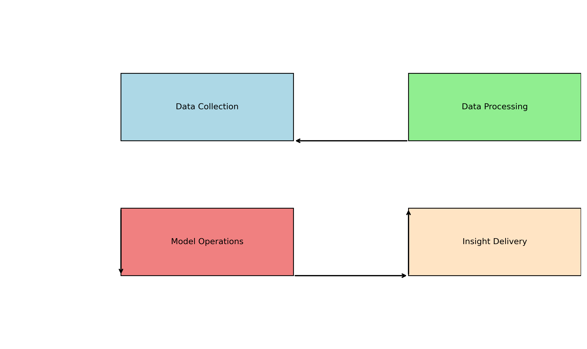

# End-to-End System Architecture for Stock Price Prediction

## 1. System Architecture Diagram

*Note: The above is a reference to where your hand-drawn or digitally created architecture diagram would be included.*

## 2. Component Justification

### Data Collection & Ingestion

**Technology Choice: Apache Kafka + Airflow**

| Component | Technology | Justification | Tradeoffs |
|-----------|------------|---------------|-----------|
| Market Data Ingestion | Apache Kafka | - Real-time data streaming capability - High throughput for market data feeds - Fault tolerance with replication | - Complexity of setup and maintenance - Requires dedicated infrastructure - Learning curve for development team |
| Alternative Data Collection | Airflow | - Orchestration of diverse data collection jobs - Scheduling flexibility for different data sources - Strong monitoring and alerting | - Primarily batch-oriented - Less suitable for real-time processing - Resource-intensive for complex workflows |
| Data Validation | Great Expectations | - Schema validation and data quality checks - Integration with both streaming and batch pipelines - Customizable validation rules | - Additional layer in the pipeline - Maintenance overhead - Performance impact on high-volume data |

**Rationale:**
The combination of Kafka and Airflow provides a hybrid approach that handles both real-time market data (prices, volumes, order book) and scheduled collection of alternative data (news, social media, economic indicators). Kafka's pub-sub model allows multiple downstream systems to consume the same data without interference, while Airflow orchestrates the more complex, scheduled data collection tasks.

### Data Processing Pipeline

**Technology Choice: Apache Spark + Delta Lake**

| Component | Technology | Justification | Tradeoffs |
|-----------|------------|---------------|-----------|
| Data Processing | Apache Spark | - Scalable processing for large datasets - Support for both batch and streaming - Rich ecosystem for ML and data processing | - Resource-intensive - Complexity in tuning for optimal performance - Steep learning curve |
| Feature Store | Feast | - Consistent feature serving across training and inference - Feature versioning and lineage tracking - Support for both batch and online features | - Relatively new technology - Limited enterprise support - Integration complexity |
| Data Storage | Delta Lake | - ACID transactions on data lake - Time travel capabilities for historical analysis - Schema enforcement and evolution | - Primarily works within Spark ecosystem - Performance overhead compared to raw files - Storage costs for versioning |

**Rationale:**
Spark provides the flexibility to handle both batch processing of historical data and micro-batch processing of streaming data. Delta Lake adds reliability and versioning to our data lake, which is crucial for financial applications where data lineage and audit capabilities are important. The feature store ensures consistency between training and inference features, addressing a common ML pipeline challenge.

### Model Operations

**Technology Choice: MLflow + Kubernetes**

| Component | Technology | Justification | Tradeoffs |
|-----------|------------|---------------|-----------|
| Experiment Tracking | MLflow | - Comprehensive experiment tracking - Model versioning and registry - Language and framework agnostic | - Requires additional infrastructure - Limited advanced features compared to commercial alternatives - Manual integration work required |
| Model Deployment | Kubernetes | - Scalable and reliable container orchestration - Support for automated scaling based on load - Robust deployment strategies (canary, blue-green) | - Operational complexity - Resource overhead - Requires DevOps expertise |
| Model Monitoring | Prometheus + Grafana | - Real-time metrics collection - Alerting capabilities - Customizable dashboards | - Setup and maintenance overhead - Storage requirements for metrics - Custom development for ML-specific metrics |

**Rationale:**
MLflow provides comprehensive tracking of experiments, models, and parameters, which is essential for reproducibility and regulatory compliance in financial applications. Kubernetes offers a robust platform for deploying models with appropriate scaling and reliability guarantees. The combination allows for automated retraining, A/B testing, and gradual rollout of model updates with appropriate safeguards.

### Insight Delivery

**Technology Choice: FastAPI + Plotly Dash**

| Component | Technology | Justification | Tradeoffs |
|-----------|------------|---------------|-----------|
| API Layer | FastAPI | - High-performance Python web framework - Automatic API documentation - Native async support for handling concurrent requests | - Less mature than alternatives like Flask - Python dependency may limit performance - Fewer extensions than established frameworks |
| Dashboard | Plotly Dash | - Interactive financial visualizations - Reactive components for real-time updates - Python-based for consistency with ML codebase | - Less customizable than pure front-end frameworks - Performance limitations with large datasets - Steeper learning curve than static dashboards |
| Alerting System | Twilio + SendGrid | - Multi-channel notifications (SMS, email) - Reliable delivery infrastructure - Comprehensive APIs for integration | - Usage-based costs can scale with volume - External dependency for critical notifications - Additional integration point |

**Rationale:**
FastAPI provides a high-performance API layer that can serve predictions with low latency, which is crucial for trading applications. Plotly Dash enables interactive dashboards that allow analysts to explore predictions and understand model decisions. The combination delivers both programmatic access for automated systems and visual interfaces for human analysts, with appropriate authentication and rate limiting.

## 3. Data Flow Explanation

### Batch vs. Streaming Decisions

The system implements a hybrid approach:

**Streaming Components:**
- Real-time market data ingestion via Kafka
- Continuous feature computation for latest market conditions
- Near-real-time prediction serving for trading signals

**Batch Components:**
- Historical data processing for model training
- Overnight feature computation for complex indicators
- Scheduled model retraining and evaluation

**Rationale:** Financial markets require both real-time responsiveness for trading decisions and deep historical analysis for model development. The hybrid approach allows us to serve predictions with low latency while still leveraging comprehensive historical data for training and backtesting.

### Data Transformation Stages

1. **Raw Data Ingestion**
   - Market data streams into Kafka topics
   - Alternative data collected via scheduled Airflow jobs
   - Data validation applied at ingestion points

2. **Feature Computation**
   - Technical indicators calculated in Spark Streaming
   - Complex features computed in overnight batch jobs
   - Features registered and versioned in the feature store

3. **Model Inference**
   - Latest features retrieved for prediction
   - Models loaded from registry with appropriate versioning
   - Predictions generated and stored with metadata

4. **Insight Generation**
   - Predictions combined with confidence intervals
   - Trading signals derived from predictions
   - Performance metrics
